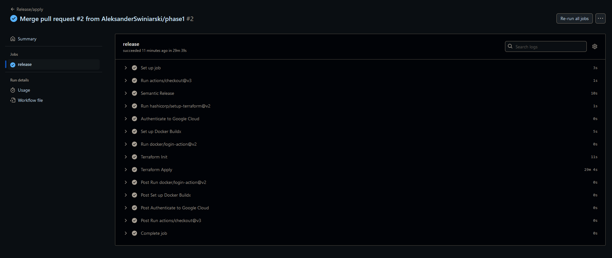
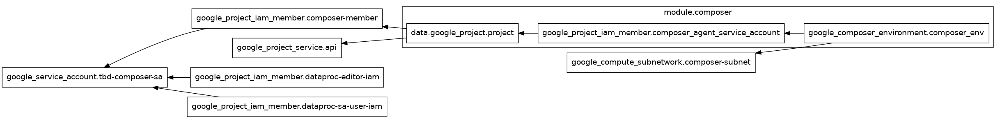
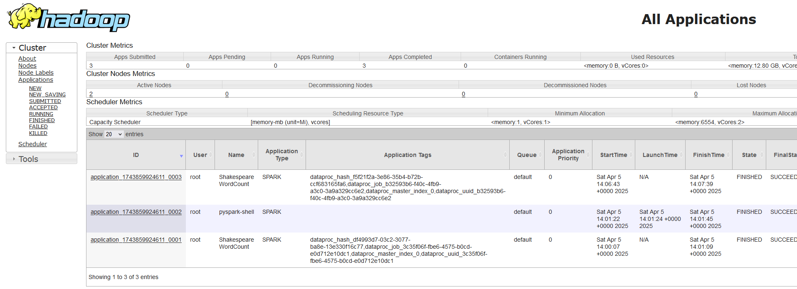
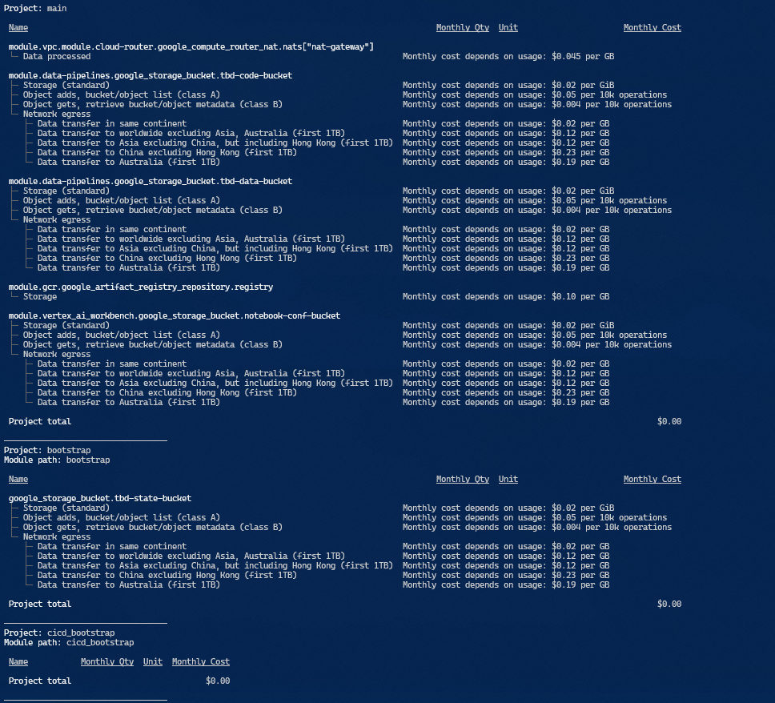
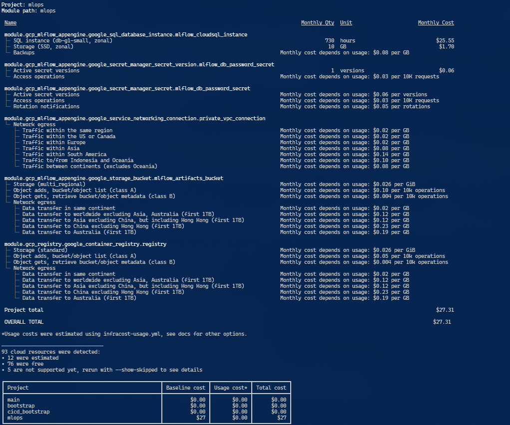
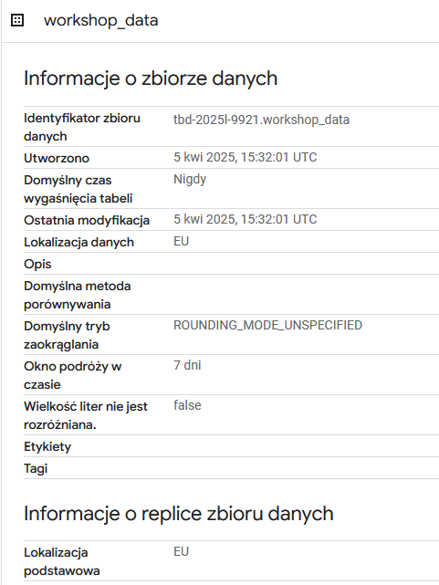
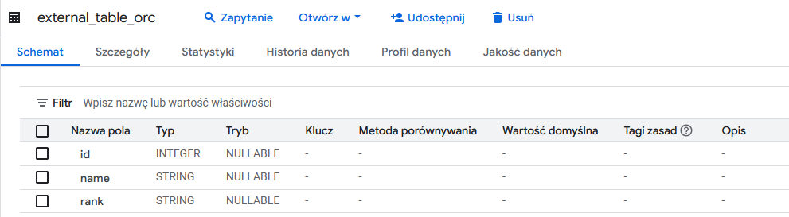
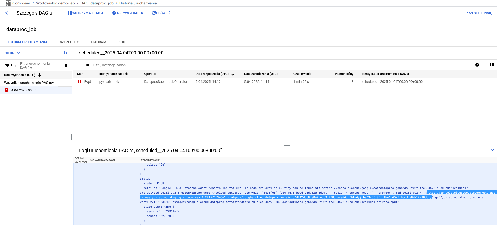

IMPORTANT ❗ ❗ ❗ Please remember to destroy all the resources after each work session. You can recreate infrastructure by creating new PR and merging it to master.


1. Authors:

   Group nr.: 8
   - Aleksander Świniarski (309423)
   - Marta Sobol (318723)
   - Magdalena Kalińska (310242)

   [Forked Repo](https://github.com/AleksanderSwiniarski/tbd-workshop-1)

2. Follow all steps in README.md.

3. In boostrap/variables.tf add your emails to variable "budget_channels".

4. From avaialble Github Actions select and run destroy on main branch.

5. Create new git branch and:
    1. Modify tasks-phase1.md file.

    2. Create PR from this branch to **YOUR** master and merge it to make new release.

    


6. Analyze terraform code. Play with terraform plan, terraform graph to investigate different modules.

    Graf modułu:
    

    Opis:
    Moduł Composer odpowiada za automatyczne utworzenie środowiska Cloud Composer 2 (czyli zarządzanego Airflowa) w Google Cloud Platform. W ramach działania tworzy dedykowane konto serwisowe, przypisuje mu niezbędne role IAM (w tym composer.worker, dataproc.editor i serviceAccountUser) oraz aktywuje wymagane API. Dodatkowo tworzy podsieć w ramach wskazanej sieci VPC, którą następnie przekazuje do modułu Composer jako środowisko sieciowe. Środowisko jest konfigurowane z parametrami dotyczącymi zasobów (CPU, RAM, storage) dla schedulera, webserwera i workerów.


7. Reach YARN UI

   ***place the command you used for setting up the tunnel, the port and the screenshot of YARN UI here***

    Aby dostać się do konsoli YARN użyliśmy komendy:
    ``` bash
    gcloud compute ssh tbd-cluster-m \
    --project=tbd-2025l-9921 \
    --zone=europe-west1-d \
    -- -L 8088:localhost:8088
    ```
    A następnie w przeglądarce weszliśmy na adres : ```http://localhost:8088```

    

8. Draw an architecture diagram (e.g. in draw.io) that includes:
    1. VPC topology with service assignment to subnets
    2. Description of the components of service accounts
    3. List of buckets for disposal
    4. Description of network communication (ports, why it is necessary to specify the host for the driver) of Apache Spark running from Vertex AI Workbech

    ***place your diagram here***

9. Create a new PR and add costs by entering the expected consumption into Infracost
For all the resources of type: `google_artifact_registry`, `google_storage_bucket`, `google_service_networking_connection`
create a sample usage profiles and add it to the Infracost task in CI/CD pipeline. Usage file [example](https://github.com/infracost/infracost/blob/master/infracost-usage-example.yml)

   Expected consumption:
   ```terraform
    version: 0.1

    resource_usage:
    google_artifact_registry_repository.my_artifact_registry:
        storage_gb: 100                 # Total data stored in the repository in GB
        monthly_egress_data_transfergb: # Monthly data delivered from the artifact registry repository in GB. You can specify any number of Google Cloud regions below, replacing - for  e.g.:
        europe_north1: 20             # GB of data delivered from the artifact registry to europe-north1.
        australia_southeast1: 30      # GB of data delivered from the artifact registry to australia-southeast1.
        china: 15                     # China excluding Hong Kong.

    google_storage_bucket.my_storage_bucket:
        storage_gb: 10                    # Total size of bucket in GB.
        monthly_class_a_operations: 100   # Monthly number of class A operations (object adds, bucket/object list).
        monthly_class_b_operations: 200   # Monthly number of class B operations (object gets, retrieve bucket/object metadata).
        monthly_data_retrieval_gb: 50     # Monthly amount of data retrieved in GB.
        monthly_egress_data_transfer_gb:  # Monthly data transfer from Cloud Storage to the following, in GB:
        same_continent: 30              # Same continent.
        worldwide: 125                  # Worldwide excluding Asia, Australia.
        asia: 15                        # Asia
        australia: 25                   # Australia.

    google_service_networking_connection.my_connection:
        monthly_egress_data_transfer_gb: # Monthly VM-VM data transfer from VPN gateway to the following, in GB:
        same_region: 25                # VMs in the same Google Cloud region.
        worldwide: 20                  # to a Google Cloud region on another continent.
   ```

   Infracost breakdown output:

   

   

10. Create a BigQuery dataset and an external table using SQL

    Kod do stworzenia BigQuery dataset:
    ```SQL
    CREATE SCHEMA IF NOT EXISTS `tbd-2025l-9921.workshop_data`
    OPTIONS (location = 'EU');
    ```

    

    Kod do stworzenia external table:
    ```SQL
    CREATE OR REPLACE EXTERNAL TABLE `tbd-2025l-9921.workshop_data.external_table_orc`
    OPTIONS (
    format = 'ORC',
    uris = ['gs://tbd-2025l-9921-data/sample.orc']
    );
    ```
    
    

    ***why does ORC not require a table schema?***

    ORC nie potrzebuje table schema ponieważ, zawiera metadane i schemat zapisane jest wewnątrz pliku (selfdescribing)

11. Find and correct the error in spark-job.py

    Jak znaleźć:
    Znaleźliśmy logi błędu w Dag'ach:
    
    Z logów dotarliśmy do pliku ```google-cloud-dataproc-metainfo_df42d3b0-e0e4-4cc9-9303-ace24df06fa4_jobs_3c35f06f-fbe6-4575-b0cd-e0d712e10dc1_driveroutput``` który wskazał nam błąd:

    ```
    : com.google.cloud.hadoop.repackaged.gcs.com.google.api.client.googleapis.json.GoogleJsonResponseException: 404 Not Found
    POST https://storage.googleapis.com/upload/storage/v1/b/tbd-2025l-9900-data/o?ifGenerationMatch=0&uploadType=multipart
    {
    "code" : 404,
    "errors" : [ {
        "domain" : "global",
        "message" : "The specified bucket does not exist.",
        "reason" : "notFound"
    } ],
    "message" : "The specified bucket does not exist."
    }
    ```

    Powód:
    Błędna nazwa bucket'a

    Fix:
    Poprawa nazwy bucket'a i dodanie katalogu ```shakespeare``` do bucketa ```gs://tbd-2025l-9921-data/data```

12. Add support for preemptible/spot instances in a Dataproc cluster

    ***place the link to the modified file and inserted terraform code***
    [Zmieniony plik](modules/dataproc/main.tf)

    Dokonana zmiana:
    ```
    preemptible_worker_config {
      num_instances = 2
    }
    ```
